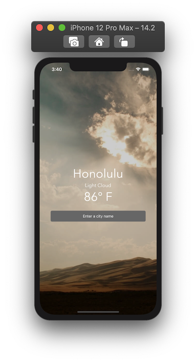

# React Native - Weather App

A weather app built using React Native. This app demonstrates:

- Using built-in and custom components
- Passing data between components
- Handling state in components
- Handling user input
- Applying styles to components
- Fetching data from a remote API
- Conditional rendering in JSX
